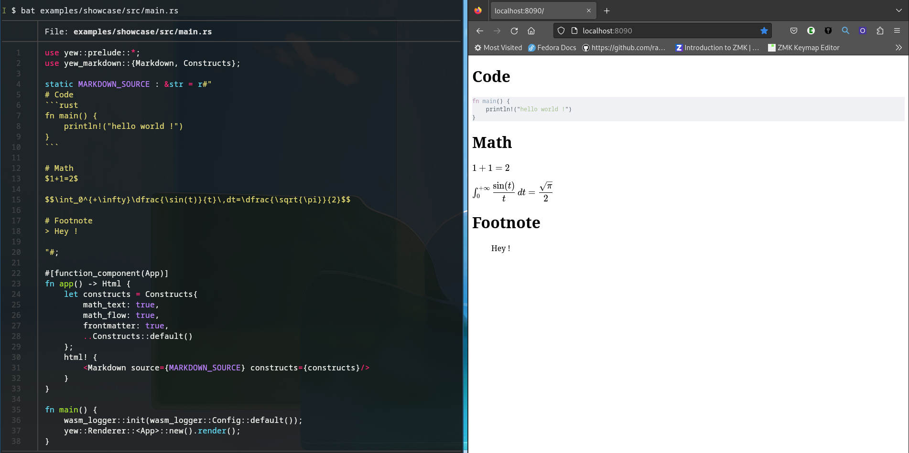

# Goal
Creating a simple library to render markdown with yew.
The best rust crates are involved !

# Usage
Add yew-markdown to your project:
```toml
# Cargo.toml
yew-markdown = {git="https://github.com/rambip/yew-markdown"}
```

If you just need to render basic markdown, you can do

```rust
use yew_markdown::Markdown;
...
    html!{
        <Markdown src={"# Markdown power !"}/>
    }
```

You also have to include this css file (if you use trunk, just add this line in your index.html):

```html
<link rel="stylesheet" href="https://cdn.jsdelivr.net/npm/katex@0.16.7/dist/katex.min.css" integrity="sha384-3UiQGuEI4TTMaFmGIZumfRPtfKQ3trwQE2JgosJxCnGmQpL/lJdjpcHkaaFwHlcI" crossorigin="anonymous">
```
Otherwise, math will not be rendered properly


# Examples
Take a look at the different examples !
You just need trunk and a web-browser to test them.

## Showcase
the example is included in `./examples/showcase`

Here is an illustration:


see [here](https://rambip.github.io/yew-markdown/showcase)

## Editor
Of course, an example of a basic markdown editor is implemented to show what is currently supported

see [here](https://rambip.github.io/yew-markdown/editor)

## Interactivity
see [here](https://rambip.github.io/yew-markdown/onclick)


# ROADMAP
- implement note reference and image reference
- publish as a crate as soon as it is stable
